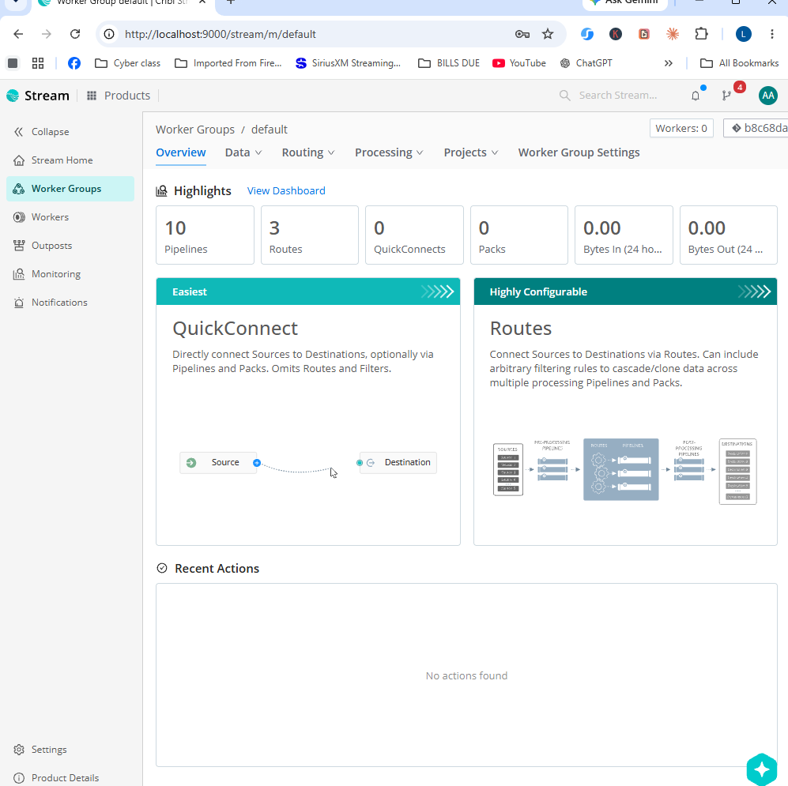
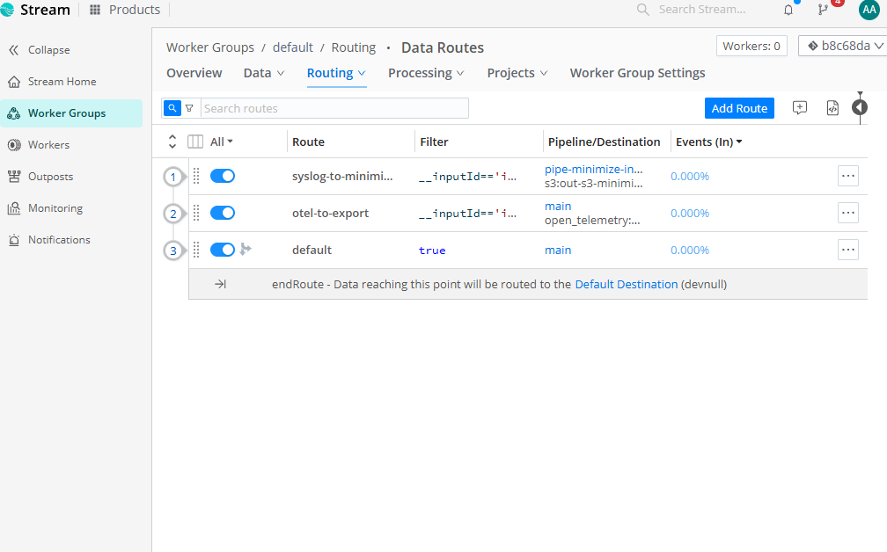
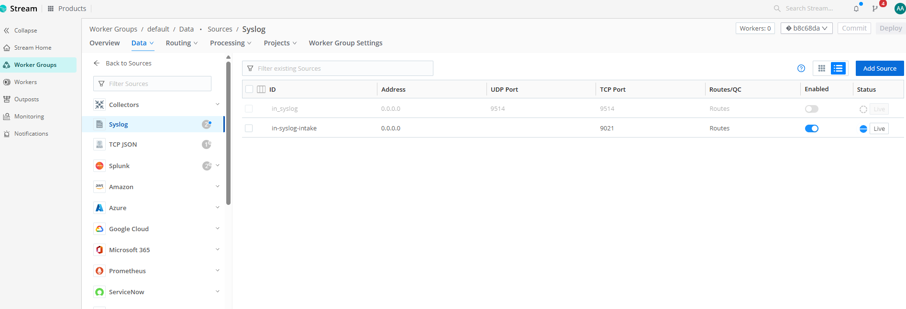
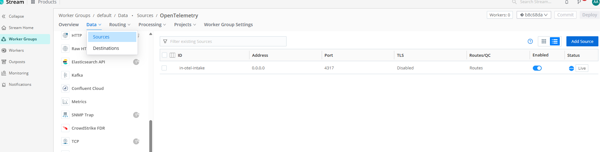
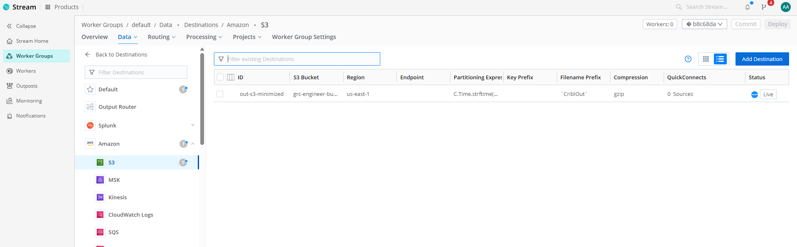
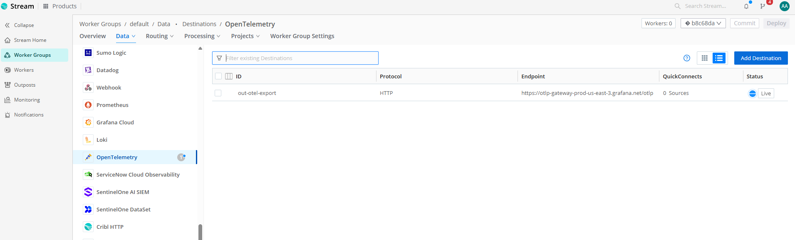
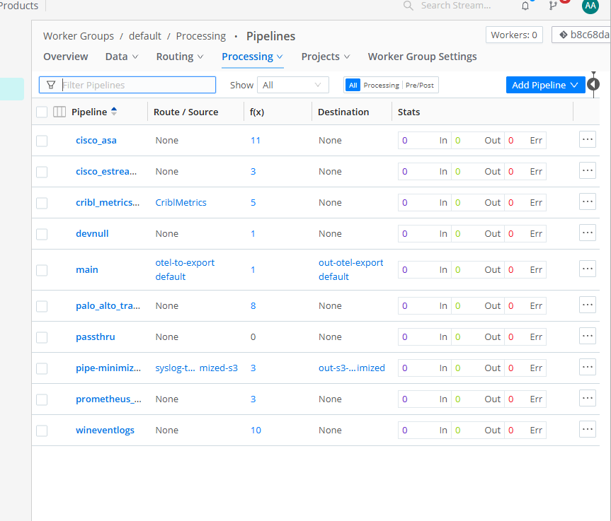

# cribl-terraform-pipeline

Cribl-as-Code: a Terraform-managed Cribl Stream deployment covering two
real ingest patterns end to end, with no manual UI configuration:

1. **Syslog → data minimization → S3.** Redacts direct identifiers, drops
   every field that isn't explicitly allowlisted, and lands the minimized
   result in an encrypted S3 bucket.
2. **OpenTelemetry (OTLP) → external observability backend.** Ingests
   traces, metrics, and logs over OTLP, extracts each span/metric/log
   record into its own event, and exports to any OTLP-compatible platform
   (Grafana Cloud, Honeycomb, Datadog, or a self-hosted otel-collector).

Built against the official [`criblio/criblio`](https://registry.terraform.io/providers/criblio/criblio/latest)
Terraform provider. Runs against either target via one `on_prem` variable:
a local/Docker Cribl Stream instance (the default — see "Why on-prem by
default" below) or a Cribl.Cloud organization.

### Why on-prem by default

This started as a Cribl.Cloud project. My Cribl.Cloud org is a free Sandbox
trial, and after working through its console (Organization page, Access
page, product Settings, Settings → Security/Advanced) there's no API
Credentials feature exposed anywhere in that UI — Cribl's own Terraform
auth docs describe a Products → Cribl → Organization → API Credentials
path that simply isn't present on this account tier. Rather than block on
that, I made the deployment target a variable (`on_prem`) and defaulted to
a local Docker Cribl Stream instance, which the provider supports natively
via username/password auth — no API Credential registration required at
all. The Terraform code itself barely changes between the two targets (see
`main.tf`'s `criblio_group` resource); this project can point at
Cribl.Cloud instead the moment API Credentials becomes available on the
org, just by flipping `on_prem = false` and exporting different
environment variables.

## Why this project

I'm 6x Cribl certified (Cribl Certified Engineer, Cribl Certified Observability
Engineer User Level 2, Cribl Certified Admin - Edge, and others) and I build
compliance-as-code projects (see
[acme-health-grc-capstone](https://github.com/Larry-Wilkes-CyberCloud/acme-health-grc-capstone))
using Terraform against AWS and GCP. This project puts those two things
together: managing Cribl itself as code, with the data-minimization logic
that a real HIPAA-adjacent ingest pipeline needs, and every control decision
documented against a citation instead of asserted.

## Architecture

```
                 ┌───────────────────────────────────────────────────────────┐
                 │                  Cribl Stream Worker Group                  │
                 │                                                             │
  Syslog (TCP)   │   ┌───────────────┐        ┌──────────────────────┐        │      S3
  ─────────────► │   │  Pipeline:    │        │  Route               │        │  ─────────►
  0.0.0.0:9021   │   │  minimize     │  ───►  │  syslog-to-minimized │        │  SSE-encrypted,
                 │   │               │        │  -s3                 │        │  gzip-compressed
                 │   │  1. mask SSN  │        └──────────────────────┘        │
                 │   │  2. mask email│                                        │
                 │   │  3. allowlist │                                        │
                 │   │     fields    │                                        │
                 │   └───────────────┘                                        │
                 │                                                             │
  OTLP            │   ┌───────────────┐        ┌──────────────────────┐        │   OTLP backend
  (gRPC/HTTP)     │   │  Pipeline:    │        │  Route               │        │   (Grafana Cloud,
  ─────────────►  │   │  main         │  ───►  │  otel-to-export      │  ───►  │   Honeycomb,
  0.0.0.0:4317    │   │  (passthrough)│        │                      │        │   Datadog, ...)
  bearer-token    │   └───────────────┘        └──────────────────────┘        │
  auth            │                                                             │
                 └───────────────────────────────────────────────────────────┘
                                          │
                                          ▼
                        criblio_commit + criblio_deploy
                        (every apply = one auditable, versioned deploy)
```

## What Terraform provisions

| Resource | Purpose |
|---|---|
| `criblio_group` | Worker Group (`product = "stream"`; `on_prem` toggles between a local/Docker instance and Cribl-managed cloud infrastructure) |
| `criblio_source` (`input_syslog`) | TCP Syslog listener, port configurable via `var.syslog_port` |
| `criblio_source` (`input_open_telemetry`) | OTLP listener (gRPC or HTTP), extracts spans/metrics/logs into individual events, bearer-token auth |
| `criblio_pipeline` | Three-function pipeline: SSN mask → email mask → field allowlist |
| `criblio_destination` (`output_s3`) | S3 output, gzip-compressed, server-side encrypted |
| `criblio_destination` (`output_open_telemetry`) | OTLP export to an external observability backend |
| `criblio_routes` | Routes Syslog traffic through the minimize pipeline to S3, and OTLP traffic through to the OTel export |
| `criblio_commit` + `data.criblio_config_version` + `criblio_deploy` | Commits and deploys the exact config version produced by this apply |

## Control mapping

Framed the same way as my Acme Health capstone: HIPAA Security Rule citations
(via NIST SP 800-66 Rev 2, which has no official OSCAL catalog of its own —
same caveat as that project), crosswalked to NIST 800-53 Rev 5 where a direct
control mapping exists.

| Control | Requirement | How this pipeline enforces it |
|---|---|---|
| HIPAA §164.514(a)/(b) — De-identification standard ↔ NIST 800-53 SI-12 | Direct identifiers must be removed or obscured before further use | Pipeline stage 1–2 (`eval`) regex-redacts SSNs and email addresses out of `_raw` before any later stage touches the event |
| HIPAA §164.502(b) / §164.514(d) — Minimum Necessary Standard ↔ NIST 800-53 SI-12, PM-25 | Limit PHI/PII exposure to the minimum necessary for the purpose | Pipeline stage 3 (`eval`, `final = true`) removes every field except an explicit, named allowlist (`_raw`, `_time`, `host`, `source`, `sourcetype`) — nothing undocumented survives |
| HIPAA §164.312(a)(2)(iv) — Encryption/Decryption ↔ NIST 800-53 SC-28 | Protect ePHI at rest | S3 Destination sets `server_side_encryption` (SSE-S3 by default, SSE-KMS via `kms_key_id` if you supply a customer-managed key) |
| HIPAA §164.312(b) — Audit Controls ↔ NIST 800-53 AU-2 / AU-3 | Record activity in systems handling ePHI | Every `terraform apply` produces a `criblio_commit` (message, author, SHA) and deploys that exact version — the pipeline's change history is a Git-backed audit trail, not tribal knowledge |
| HIPAA §164.312(e)(1) — Transmission Security ↔ NIST 800-53 SC-8 | Guard against unauthorized access to ePHI in transit | **Not enforced in this build** — see Known Limitations below |

## OpenTelemetry ingestion and export

The HIPAA/data-minimization framing above applies to the Syslog path — OTLP
telemetry (spans, metrics, logs) isn't PHI, so it isn't forced into that
table. What the OTel path demonstrates instead is the piece most
observability-engineering roles actually care about day to day: getting
telemetry data *into* Cribl from instrumented services, and *out* to
whichever backend the org standardizes on, without hand-wiring every
service to every backend.

- `criblio_source.otel` listens for OTLP over gRPC (default) or HTTP,
  authenticated with a bearer token, and enables `extract_spans`,
  `extract_metrics`, and `extract_logs` so each span/data point/log record
  becomes its own Cribl event — the same event model Syslog data uses,
  so the same Routes/Pipelines infrastructure applies to both.
- `criblio_destination.otel_export` re-exports over OTLP to any
  OTLP-compatible backend. Swap `otel_destination_endpoint` and you're
  pointed at a different platform — Grafana Cloud, Honeycomb, Datadog,
  or a self-hosted otel-collector — with no pipeline changes. That's the
  "routed and optimized across multiple monitoring platforms" pattern in
  practice: Cribl as the vendor-agnostic routing layer between
  instrumented services and whatever's downstream.
- The `otel-to-export` Route currently uses the `main` (passthrough)
  Pipeline. A real deployment would likely insert a Pipeline stage here
  too — e.g., dropping high-cardinality debug spans, sampling noisy
  metrics, or enriching with `service.name`/`deployment.environment`
  tags — the same pattern already proven on the Syslog side, just applied
  to telemetry instead of PII.

## Prerequisites

- Terraform >= 1.0
- Docker (for the default on-prem target) — Docker Desktop on Windows/Mac,
  or the Docker Engine directly on Linux
- An S3 bucket and an IAM user/key scoped to `s3:PutObject` on that bucket
  only (least privilege — don't use broad credentials here)
- An OTLP-compatible backend to export telemetry to — a free-tier
  [Grafana Cloud](https://grafana.com/products/cloud/) or
  [Honeycomb](https://www.honeycomb.io/) account both work, or a local
  `otel-collector` if you'd rather not sign up for anything
- If targeting Cribl.Cloud instead (`on_prem = false`): an org with API
  Credentials available (Org Settings → API Credentials → New Credential —
  see [Cribl's Terraform auth docs](https://docs.cribl.io/cribl-as-code/terraform-auth/#terraform-auth-cloud))

## Authenticating

Credentials are environment variables only — never Terraform variables, so
nothing sensitive lands in `terraform.tfvars`, state, or this repo.

**On-prem / Docker (default):**

```bash
# CRIBL_DIST_MODE=leader is required — this project manages a Worker Group
# via the criblio_group resource, and Worker Groups only exist on a Leader
# node. A plain `docker run cribl/cribl:latest` with no CRIBL_DIST_MODE boots
# single-instance mode instead, which has no /groups API at all and makes
# `terraform apply` fail with "Cannot POST /api/v1/products/stream/groups".
docker run -d --name cribl-stream \
  -e CRIBL_DIST_MODE=leader \
  -p 9000:9000 \
  -p 9021:9021 \
  -p 4317:4317 \
  -p 4200:4200 \
  cribl/cribl:latest

# UI: http://localhost:9000, default login admin/admin (change it)

export CRIBL_ONPREM_SERVER_URL="http://localhost:9000"
export CRIBL_ONPREM_USERNAME="admin"
export CRIBL_ONPREM_PASSWORD="admin"   # or whatever you changed it to
```

**Cribl.Cloud** (once you have an API Credential):

```bash
export CRIBL_CLIENT_ID="..."
export CRIBL_CLIENT_SECRET="..."
export CRIBL_ORGANIZATION_ID="..."
export CRIBL_WORKSPACE_ID="..."
```
and set `on_prem = false` in `terraform.tfvars`.

## Deploying

```bash
cp terraform.tfvars.example terraform.tfvars
# edit terraform.tfvars — at minimum confirm on_prem, aws_bucket_name/
# aws_region/aws_api_key/aws_secret_key, and the otel_destination_* values

terraform init
terraform validate
terraform plan   # review before applying
terraform apply
```

`terraform.tfvars` is gitignored — it holds live AWS/OTel credentials and
should never be committed.

### Verifying it worked

1. In the Cribl UI (`http://localhost:9000` for on-prem, or the
   Cribl.Cloud console for cloud), open the Worker Group named by
   `worker_group_id` and confirm both Sources, the Pipeline, both
   Destinations, and the Routes match this repo — see Screenshots below.
2. **Syslog path:** with a Worker Node attached to the group, send a test
   event and confirm SSNs/emails in the raw payload arrive redacted, and
   unlisted fields are gone:
   ```bash
   echo "<14>test user ssn 123-45-6789 email test@example.com" | nc <cribl-host> <syslog_port>
   ```
   Confirm the object lands in S3 with server-side encryption applied.
3. **OTel path:** with a Worker Node attached, send a test span/trace with
   any OTLP exporter (e.g. the
   [`otel-cli`](https://github.com/equinix-labs/otel-cli) tool, or a quick
   instrumented script) pointed at `<cribl-host>:<otel_port>` with your
   `otel_bearer_token` as the auth header, and confirm it arrives at the
   configured backend (Grafana Explore, Honeycomb's query UI, etc.).
4. Screenshot the deployed pipeline, a redacted sample event, and the
   OTel trace arriving in your chosen backend — drop them in
   `screenshots/` for the portfolio writeup.

## Screenshots

Captured from a real `terraform apply` against local Docker Cribl Stream
(single-container, leader mode — see Known Limitations for what that
does and doesn't prove):

| | |
|---|---|
|  Worker Group overview — 10 Pipelines, 3 Routes provisioned by this repo |  Routes: `syslog-to-minimized-s3`, `otel-to-export`, `default` |
|  Syslog Source `in-syslog-intake`, port 9021 |  OpenTelemetry Source `in-otel-intake`, port 4317 |
|  S3 Destination `out-s3-minimized`, gzip + SSE |  OpenTelemetry Destination `out-otel-export` → Grafana Cloud |
|  `pipe-minimize-intake` — 3 functions (SSN mask, email mask, field allowlist), with Cribl's own generated description of the logic | |

## Known limitations

Documented honestly rather than glossed over, same as the trade-offs section
in my Acme Health capstone:

- **TLS is disabled on both Sources** (`tls.disabled = true`) for local
  testing simplicity. A production deployment handling real PII/PHI in
  transit — or a bearer token, in the OTel Source's case — must enable TLS
  (SC-8 / §164.312(e)(1)). The `tls` block on both `input_syslog` and
  `input_open_telemetry` supports `certificate_name`, `cert_path`/
  `priv_key_path`, and `min_version`, but that requires provisioning real
  certificates, which is out of scope for a portfolio demo. Shipping a
  bearer token over plaintext gRPC, specifically, is something I'd never
  do outside a local/private test — flagging it here rather than
  pretending the demo is production-ready.
- **The masking stage uses regex, not Cribl's purpose-built Mask function.**
  I chose two `eval` functions with verified, documented `add`/`remove`/`keep`
  syntax over guessing at the Mask function's JSON config shape, which isn't
  documented in the provider's own examples. Functionally equivalent for the
  demo; a production pipeline would likely use Mask (or a Lookup-based
  allowlist) for maintainability at scale.
- **The OTel path has no transformation stage.** It routes through the
  `main` passthrough Pipeline rather than a dedicated one — I chose not to
  guess at exact field names Cribl assigns to extracted OTLP data (span
  attributes, resource attributes, etc.) without a live source to verify
  against, for the same reason I avoided the undocumented Mask function
  above. Worth building out once I can inspect real extracted events.
- **No policy-as-code gate.** Unlike the AWS capstone (Rego/Conftest/OSCAL),
  this repo is Terraform only — there's no automated check that a future
  change can't reintroduce an unmasked field or a plaintext destination.
  That's the natural next step if this project grows (see below).
- **No live event testing in this demo.** The Docker container in the
  screenshots runs in leader-only mode (`CRIBL_DIST_MODE=leader`, 0 Worker
  Nodes attached) — required so `criblio_group` has a Worker Group API to
  provision against at all, since single-instance mode has none (see
  `provider.tf`/README history). But a Leader manages config; it doesn't
  execute Pipeline functions itself, and even Cribl's own in-UI Preview
  requires an attached Worker. So the masking logic here is verified by
  inspection — the Pipeline's 3 functions and Cribl's own generated
  description of what they do (screenshot below) — rather than a live
  redacted-event capture. Attaching a second container as a real Worker
  Node, then re-running the Syslog/OTel test steps above, is the natural
  next step.

## What I'd add with more time

- A CI pipeline (GitHub Actions) that runs `terraform plan` + `terraform
  validate` on every PR against a sandbox Worker Group
- An OPA/Conftest policy asserting the allowlist stage always has
  `final = true` and the S3 destination always sets
  `server_side_encryption`
- TLS on both Sources using a Cribl-managed or self-signed cert for a
  fully in-transit-protected demo
- A real transformation Pipeline on the OTel path (sampling, high-
  cardinality field drops, resource-attribute enrichment) once I've
  inspected actual extracted-event field names against a live Source
